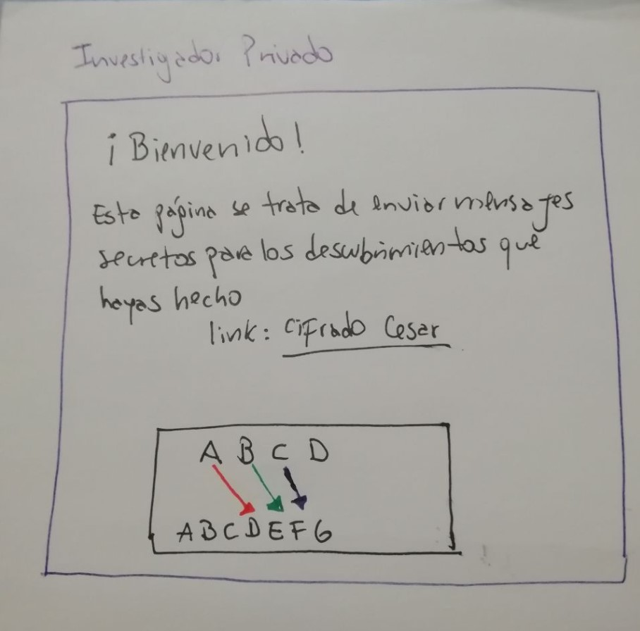
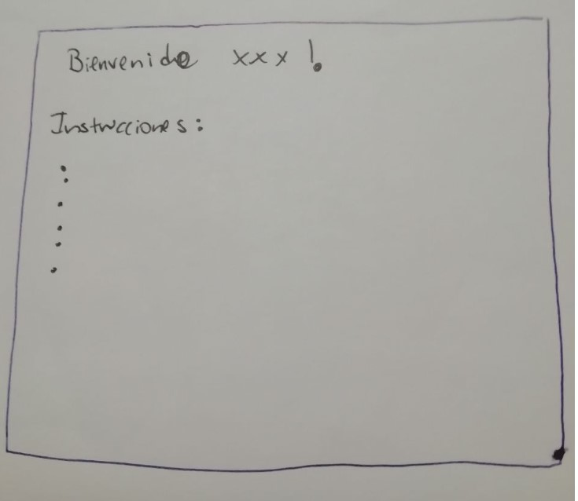
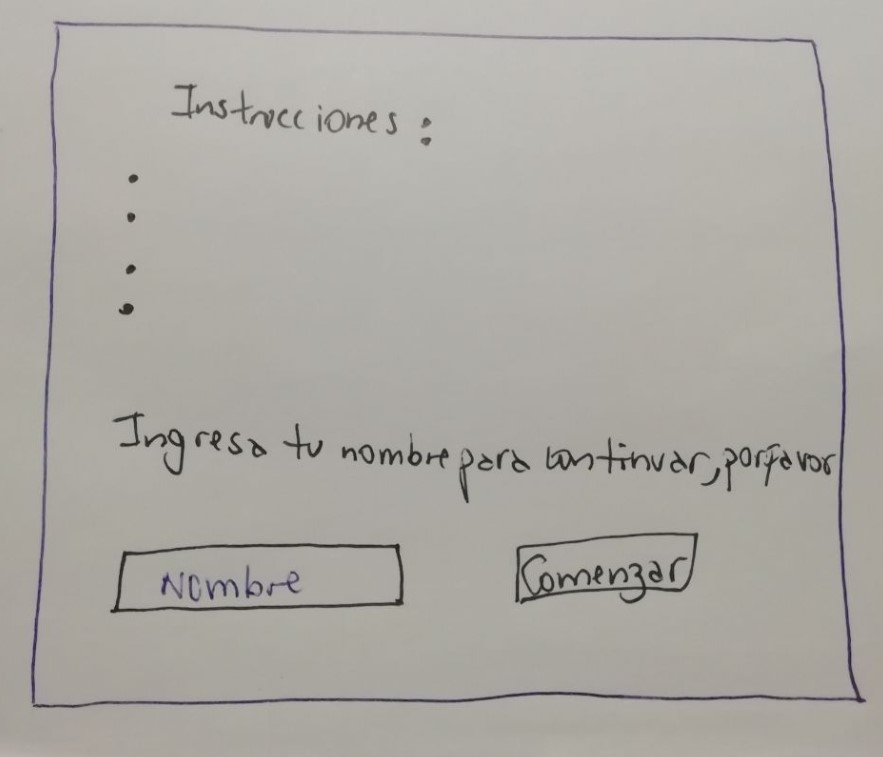
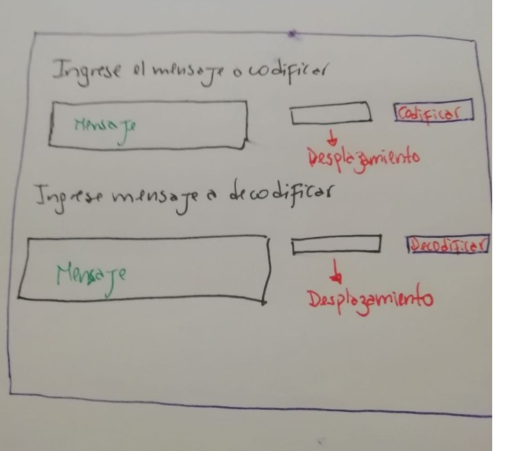
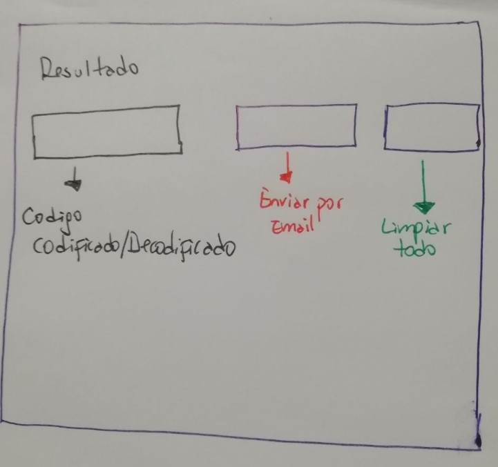

# Investigador privado
Investigador Privado es una herramienta para codificar y decodificar mensajes, al usuario se le pide un número secreto el cual es usado para efectuar esta tarea, esta aplicación tras bambalinas utiliza el [Cifrado Cesar](https://es.wikipedia.org/wiki/Cifrado_C%C3%A9sar).

## A quien está dirigido
Esta dirigido a usuarios que deseen transmitir información sensible (Claves, mensajes personales, informacion laboral,secretos,etc.)

#### Objetivo 
Que los usuarios dispongan de esta herramienta para codificar sus mensajes y estos puedan ser compartidos con terceros.

#### Que se resuelve 
Se resuelve la problemática del usuario el cual desea preservar la confidencialidad de la transmisión de la información con sus destinatarios y en el caso de que el mensaje sea interceptado, este sea ilegible.   

## Introducción a la aplicación 
Te damos la bienvenida a nuestra aplicación "Investigador privado", con esta aplicación podrás codificar mensajes con el objetivo de hacer difícil la lectura del mensaje original por terceros. Este mensaje codificado podra ser decodificado por tu destinatario de manera sencilla si tú y tu destinatario conocen el secreto en común.

## Funcionalidad
La aplicación Investigador Privado para la codificación y decodificación del mensaje se apoya en el Cifrado Cesar, se usa la codificación por desplazamiento, el cual explicado de manera sencilla, dado un texto, por cada letra se desplaza N veces en el alfabeto.

## Prototipo
Pantalla de bienvenida

Pantalla Instrucciones

Pantalla comenzar

Pantalla codificar/decodificar

Pantalla resultado

## Links
* Testing de usuario
  * [Usuario 1](https://youtu.be/X8mGN8yTBAM)
  * [Usuario 2](https://youtu.be/Pz0yCVy6o6k)
* [Trello](http://trello.com/b/NkxacmNA/pagina-web)
* [Cifrado Cesar `Wikipedia`](https://es.wikipedia.org/wiki/Cifrado_C%C3%A9sar)